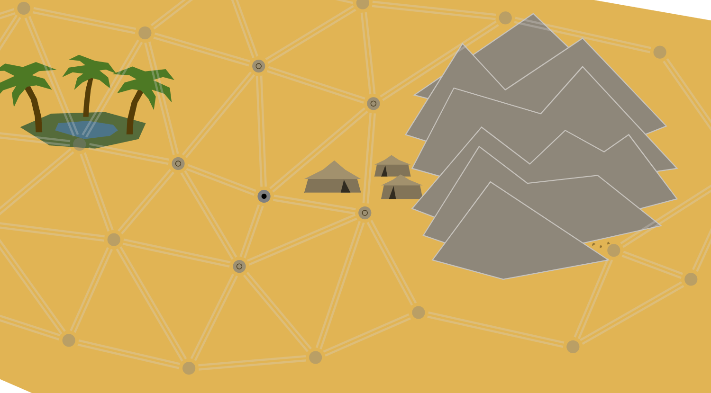

# Freemake

This repository contains program code and resources to build the video game [Freemake](https://gamelab-zone.itch.io/freemake)

For background and project history, see the post at [A Remake of Freewar - Introducing Freemake](https://forum.gamelab.zone/t/a-remake-of-freewar-introducing-freemake/120)

## Hacking

The easiest way to make changes to the game is by opening it in Elm Editor at https://elm-editor.com/?project-state=https%3A%2F%2Fgithub.com%2FViir%2FFreemake%2Ftree%2Fmain%2Fimplement&file-path-to-open=Main.elm

If you are not working in Elm Editor, you can use the [Elm Fullstack compiler](https://github.com/elm-fullstack/elm-fullstack/releases) with the script [`implement/run.bat`](./implement/run.bat) to compile and run the app.

## Backlog

+ Make walking easier: Support walking also by clicking nodes which appear reachable in the current game state. If multiple paths are possible to reach the node, let the character take the shortest path.
+ Create a denser atmosphere: Add acoustic support, sounds suiting the current location (Different between desert surface and cave).
+ Integrate nicer visuals: Improve readability of or variety in the cave.
+ Use less abrupt visual transition for locally offered actions when the player moves. (At the moment, the location-specific text changes instantly without smooth transition).
